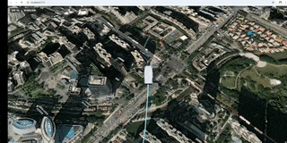

# cesium 探索
::: tip
最近公司在弄一个无人机的可视化大屏项目，地图用的是mapboxgl。

然后无聊尝试Cesium，结果还是非常不错，三维的效果非常棒，做了了一个小案例玩玩，效果如下：
:::

## 效果预览


[预览-传送阵](https://cesium.saozijun.top/)

## 1. 注册 Cesium 
Cesium 使用是要token，所以需要注册一个账号。注册 Cesium 官网：[Cesium](https://cesium.com/)

## 2. 安装 Cesium 依赖
由于我是vue3.0项目，所以安装方式如下：

```bash
npm install cesium 
```
然后直接引入就可以了。

## 3. 更换地图底图
cesium 地图默认是英文语言

所以需要更换地图底图，这里我使用的是 [天地图](http://lbs.tianditu.gov.cn/server/MapService.html)。

里面有很多免费的底图选择

## 4. 查看完整页面代码

::: details 点我查看组件代码

```js [cesium.vue]
<template>
  <div class="cesium-container">
    <div id="cesium-container" ref="cesiumContainer"></div>
    <div class="toolbar">
      <button @click="toggleViewAircraft">{{ isTracking ? '取消查看' : '查看飞机' }}</button>
      <button @click="toggleLookAtTransform">{{ isLookAtTransform ? '取消锁定视角' : '锁定视角' }}</button>
    </div>
  </div>
</template>

<script setup>
import { onMounted, ref, onUnmounted } from "vue";
import * as Cesium from "cesium";
import "cesium/Build/Cesium/Widgets/widgets.css";
import { flightRoutes } from "../utils/flightRoutes";
Cesium.Ion.defaultAccessToken = "你的 Cesium token";

const cesiumContainer = ref(null);
let viewer = null;
let entity = null;
const isTracking = ref(false);
const isLookAtTransform = ref(false);

// 设置随机数种子以获得一致的结果
function setRandomSeed() {
  Cesium.Math.setRandomNumberSeed(3);
}

// 根据航点创建飞行路径
function createFlightPath(waypoints, start, duration) {
  const property = new Cesium.SampledPositionProperty();
  const waypointCount = waypoints.length;
  
  // 计算每个航点的时间间隔
  const timeStep = duration / (waypointCount - 1);
  
  waypoints.forEach((waypoint, index) => {
    const [lon, lat, height] = waypoint;
    const time = Cesium.JulianDate.addSeconds(
      start, 
      index * timeStep, 
      new Cesium.JulianDate()
    );
    
    const position = Cesium.Cartesian3.fromDegrees(lon, lat, height);
    property.addSample(time, position);
    
    // 为每个航点创建一个标记点
    viewer.entities.add({
      position: position,
      point: {
        pixelSize: 8,
        color: Cesium.Color.TRANSPARENT,
        outlineColor: Cesium.Color.YELLOW,
        outlineWidth: 3,
      },
    });
  });
  
  return property;
}

// 重置视角到广州塔
const resetCameraToTower = () => {
  const guangzhouTowerRoute = flightRoutes.route1.waypoints;
  viewer.camera.flyTo({
    destination: Cesium.Cartesian3.fromDegrees(
      guangzhouTowerRoute[0][0], // 经度
      guangzhouTowerRoute[0][1] - 0.028, // 纬度
      guangzhouTowerRoute[0][2] + 1500 // 高度 + 1500米观察
    ),
    orientation: {
      heading: Cesium.Math.toRadians(0),
      pitch: Cesium.Math.toRadians(-30),
      roll: 0.0,
    },
    duration: 1.5, // 飞行时间
  });
};

// 取消所有跟踪和锁定
const cancelAllTracking = () => {
  // 取消跟踪实体
  viewer.trackedEntity = undefined;
  isTracking.value = false;
  
  // 取消锁定视角
  viewer.scene.camera.lookAtTransform(Cesium.Matrix4.IDENTITY);
  if (isLookAtTransform.value) {
    viewer.scene.preRender.removeEventListener(updateLookAtTransform);
    isLookAtTransform.value = false;
  }
};

// 切换查看飞机状态
const toggleViewAircraft = () => {
  if (isTracking.value) {
    // 取消跟踪
    cancelAllTracking();
    resetCameraToTower();
  } else {
    // 如果当前处于锁定视角状态，先取消锁定
    if (isLookAtTransform.value) {
      viewer.scene.preRender.removeEventListener(updateLookAtTransform);
      viewer.scene.camera.lookAtTransform(Cesium.Matrix4.IDENTITY);
      isLookAtTransform.value = false;
    }
    
    // 跟踪飞机
    if (entity) {
      viewer.trackedEntity = entity;
      isTracking.value = true;
    }
  }
};

// 切换锁定视角状态
const toggleLookAtTransform = () => {
  if (isLookAtTransform.value) {
    // 取消锁定视角
    viewer.scene.camera.lookAtTransform(Cesium.Matrix4.IDENTITY);
    viewer.scene.preRender.removeEventListener(updateLookAtTransform);
    isLookAtTransform.value = false;
    resetCameraToTower();
  } else {
    // 如果当前处于跟踪状态，先取消跟踪
    if (isTracking.value) {
      viewer.trackedEntity = undefined;
      isTracking.value = false;
    }
    
    // 锁定视角
    if (entity) {
      // 创建一个以飞机为中心的参考系
      const lookAtPosition = entity.position.getValue(viewer.clock.currentTime);
      if (lookAtPosition) {
        // 计算从飞机前方和上方观察的位置
        const offset = new Cesium.Cartesian3(-80, 30, 20); // 前方30米，上方20米
        
        // 创建一个以飞机为中心的变换矩阵
        const transform = Cesium.Transforms.eastNorthUpToFixedFrame(lookAtPosition);
        
        // 设置相机锁定在这个参考系上
        viewer.scene.camera.lookAtTransform(transform, offset);
        
        // 添加事件监听器以实时更新锁定位置
        viewer.scene.preRender.addEventListener(updateLookAtTransform);
        isLookAtTransform.value = true;
      }
    }
  }
};

// 更新锁定视角位置
function updateLookAtTransform() {
  if (isLookAtTransform.value && entity) {
    const lookAtPosition = entity.position.getValue(viewer.clock.currentTime);
    if (lookAtPosition) {
      // 获取实体的方向
      const orientation = entity.orientation.getValue(viewer.clock.currentTime);
      if (orientation) {
        // 创建一个以飞机为中心的变换矩阵，考虑飞机的朝向
        const transform = Cesium.Matrix4.fromRotationTranslation(
          Cesium.Matrix3.fromQuaternion(orientation),
          lookAtPosition
        );
        
        // 计算从飞机前方和上方观察的位置
        const offset = new Cesium.Cartesian3(-40, 0, 50); // 前方30米，上方10米
        
        // 设置相机锁定在这个参考系上
        viewer.scene.camera.lookAtTransform(transform, offset);
      }
    } else {
      cancelAllTracking();
    }
  }
}

onMounted(async () => {
  // 初始化Cesium Viewer
  viewer = new Cesium.Viewer("cesium-container", {
    terrainProvider: await Cesium.createWorldTerrainAsync(), // 使用Cesium世界地形
    baseLayerPicker: false, // 禁用基础图层选择器
    animation: false, // 禁用动画控件
    timeline: false, // 禁用时间线
    sceneModePicker: false, // 禁用场景模式选择器
    navigationHelpButton: false, // 禁用导航帮助按钮
    homeButton: false, // 禁用主页按钮
    geocoder: false, // 禁用地理编码器
    infoBox: false, // 禁用信息框
    selectionIndicator: false, // 禁用选择指示器
    shouldAnimate: true,
  });

  // 启用深度检测以实现三维地形效果
  viewer.scene.globe.depthTestAgainstTerrain = true;
  
  // 启用基于太阳位置的照明
  viewer.scene.globe.enableLighting = true;

  // 添加天地图注记层
  const tdtAnnotation = new Cesium.WebMapTileServiceImageryProvider({
    url: "http://t2.tianditu.gov.cn/cia_w/wmts?tk=你的天地图token",
    layer: "cia",
    style: "default",
    format: "tiles",
    tileMatrixSetID: "w",
    maximumLevel: 18,
    credit: new Cesium.Credit("天地图全球注记服务"),
  });
  viewer.imageryLayers.addImageryProvider(tdtAnnotation);

  // 设置随机数种子
  setRandomSeed();

  // 设置模拟时间的边界
  const start = Cesium.JulianDate.fromDate(new Date());
  const duration = 360; // 飞行持续时间（秒）
  const stop = Cesium.JulianDate.addSeconds(start, duration, new Cesium.JulianDate());

  // 确保查看器处于所需的时间
  viewer.clock.startTime = start.clone();
  viewer.clock.stopTime = stop.clone();
  viewer.clock.currentTime = start.clone();
  viewer.clock.clockRange = Cesium.ClockRange.LOOP_STOP; // 在结束时循环
  viewer.clock.multiplier = 5; // 时间流速

  // 获取广州塔航线
  const guangzhouTowerRoute = flightRoutes.route1.waypoints;
  
  // 创建飞行路径
  const position = createFlightPath(guangzhouTowerRoute, start, duration);
  
  // 添加整条航线的默认样式
  const positions = guangzhouTowerRoute.map(waypoint => {
    const [lon, lat, height] = waypoint;
    return Cesium.Cartesian3.fromDegrees(lon, lat, height);
  });
  
  viewer.entities.add({
    polyline: {
      positions: positions,
      width: 2,
      material: new Cesium.PolylineDashMaterialProperty({
        color: Cesium.Color.LIGHTSKYBLUE.withAlpha(0.5),
        dashLength: 8.0
      }),
      clampToGround: false
    }
  });

  // 创建高级路径材质
  const pathMaterial = new Cesium.PolylineGlowMaterialProperty({
    glowPower: 0.3,
    color: Cesium.Color.CYAN.withAlpha(0.7),
    taperPower: 0.5
  });

  // 创建实体
  entity = viewer.entities.add({
    // 将实体可用性设置为与模拟时间相同的间隔
    availability: new Cesium.TimeIntervalCollection([
      new Cesium.TimeInterval({
        start: start,
        stop: stop,
      }),
    ]),

    // 使用计算的位置
    position: position,

    // 根据位置移动自动计算方向
    orientation: new Cesium.VelocityOrientationProperty(position),

    // 加载无人机模型
    model: {
      uri: "uav/scene.gltf",
      minimumPixelSize: 64,
      scale: 1,
    },

    // 高级科技感路径
    path: {
      resolution: 1,
      material: pathMaterial,
      width: 12,
      leadTime: 0,
      trailTime: 60,
    }
  });

  // 设置位置插值选项
  entity.position.setInterpolationOptions({
    interpolationDegree: 2,
    interpolationAlgorithm: Cesium.HermitePolynomialApproximation,
  });

  // 将视角定位到广州塔
  viewer.camera.flyTo({
    destination: Cesium.Cartesian3.fromDegrees(
      guangzhouTowerRoute[0][0], // 经度
      guangzhouTowerRoute[0][1] - 0.023, // 纬度
      guangzhouTowerRoute[0][2] + 1500 // 高度 + 1500米观察
    ),
    orientation: {
      heading: Cesium.Math.toRadians(0),
      pitch: Cesium.Math.toRadians(-30),
      roll: 0.0,
    },
    duration: 3, // 飞行时间
  });
});

onUnmounted(() => {
  // 移除事件监听器
  if (viewer && isLookAtTransform.value) {
    viewer.scene.preRender.removeEventListener(updateLookAtTransform);
  }

  // 销毁viewer
  if (viewer) viewer.destroy();
});

</script>

<style scoped>
.cesium-container {
  width: 100%;
  height: 100vh;
  margin: 0;
  padding: 0;
  overflow: hidden;
  position: relative;
}

.toolbar {
  position: absolute;
  top: 10px;
  left: 10px;
  z-index: 1000;
}

.toolbar button {
  background-color: rgba(42, 42, 42, 0.8);
  border: 1px solid #444;
  color: white;
  padding: 5px 10px;
  margin: 5px;
  border-radius: 4px;
  cursor: pointer;
}

.toolbar button:hover {
  background-color: rgba(60, 60, 60, 0.8);
}
</style>

```

:::